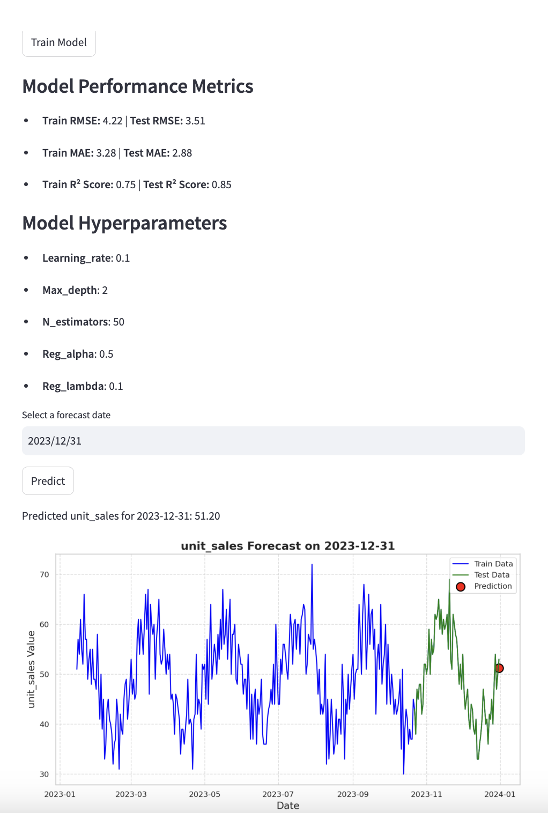

# Streamlit Time Series Forecasting App

This repository contains a Streamlit-based application for time series forecasting using XGBoost. It allows users to upload a CSV file, train a model, visualize the results, and make predictions.

### Logic of the Code

This code implements a **Time Series Forecasting** application using **XGBoost** and **Streamlit**. It allows users to upload a CSV file containing time-series data, preprocess the data, train an XGBoost model, and make predictions. Below is a breakdown of the logic:

1. **Data Upload and Preprocessing**:
   - The app accepts a CSV file with at least two columns: `date` (in `YYYY-MM-DD` format) and a target variable (e.g., `unit_sales`).
   - The `preprocess_data` function ensures the required columns are present, converts the `date` column to datetime format, and adds time-based features like `dayofweek`, `month`, and `year`.
   - It also creates lag features (e.g., `lag_1`, `lag_7`, `lag_14`) and a rolling mean (`rolling_mean_7`) to capture temporal patterns in the data.

2. **Model Training**:
   - The `train_model` function uses **XGBoost** for time-series forecasting.
   - It splits the data into training and test sets using **TimeSeriesSplit** to preserve the temporal order of the data.
   - A **GridSearchCV** is employed to find the best hyperparameters for the XGBoost model, optimizing for the lowest mean squared error (MSE).
   - The best model and its hyperparameters are saved in the Streamlit session state for later use.

3. **Model Evaluation**:
   - The `calculate_metrics` function computes evaluation metrics such as **RMSE**, **MAE**, and **R² score** for both the training and test datasets.
   - These metrics are displayed to the user to assess the model's performance.

4. **Prediction and Visualization**:
   - Users can select a date for forecasting, and the app uses the trained model to predict the target variable for that date.
   - The `plot_predictions` function visualizes the actual vs predicted values, highlighting the training data, test data, and the predicted value.

5. **Model Download**:
   - The trained model can be downloaded in two formats: **XGBoost binary format** (`.xgb`) and **Pickle format** (`.pkl`), allowing users to reuse the model outside the app.

6. **Streamlit Interface**:
   - The app provides an intuitive interface for uploading data, training the model, and making predictions.
   - It displays processed data samples, model performance metrics, and hyperparameters for transparency.

### Key Features:
- **Time-Series Specific Preprocessing**: Handles temporal data by adding lag features and rolling statistics.
- **Hyperparameter Tuning**: Uses GridSearchCV to optimize the XGBoost model.
- **Interactive Visualization**: Plots the actual vs predicted values for better insights.
- **Model Export**: Allows users to download the trained model for offline use.

This application is ideal for users who want to perform time-series forecasting with minimal coding effort, leveraging the power of XGBoost and Streamlit's interactive capabilities.


## Features
- Upload a dataset with `date` and a target variable column
- Preprocesses data and adds time-based features
- Trains an XGBoost model using time series cross-validation
- Displays model performance metrics (MSE, MAE, R²)
- Generates forecasts and visualizes the results
- Allows downloading the trained model

## Setting Up the Project from Scratch

Follow these steps to create and deploy this Streamlit application from scratch.

### **1. Delete any existing repository (if applicable)**
```bash
rm -rf streamlit-time-series
```

### **2. Create a new repository**
```bash
mkdir streamlit-time-series
cd streamlit-time-series
```

### **3. Set up the project structure**
```bash
mkdir Input
mkdir Output
mkdir app
mkdir notebooks
mkdir scripts
touch requirements.txt
touch README.md
touch app/app.py
```

### **4. Move the training dataset to the `Input` folder**
```bash
mv /path/to/downloaded/training_data.csv Input/
```

### **5. Create a virtual environment and install dependencies**
```bash
python -m venv venv
source venv/bin/activate  # Windows: venv\Scripts\activate
pip install streamlit pandas numpy matplotlib seaborn xgboost scikit-learn
pip freeze > requirements.txt
```

### **6. Initialize Git and make the first commit**
```bash
git init
git add .
git commit -m "Initial project setup"
```

### **7. Create a new repository on GitHub and push the code**
```bash
git remote add origin https://github.com/your-username/your-repository.git
git push -u origin main
```

### **8. Run the Streamlit application locally**
```bash
streamlit run app/app.py
```
Your application will be available at `http://localhost:8501/`.

---

## Deploying to Streamlit Community Cloud

### **9. Deploy the app on Streamlit Cloud**
1. Go to [Streamlit Cloud](https://share.streamlit.io/)
2. Sign in with your GitHub account
3. Click `New app`
4. Select your GitHub repository
5. Set the main file path to `app/app.py`
6. Click `Deploy`

### **10. Your Streamlit App is Live!**
Once deployed, you will get a live URL like:
```
https://your-app-name.streamlit.app
```

---

## Updating Your App
To make changes to your app:
```bash
git add .
git commit -m "Updated app"
git push origin main
```
Your Streamlit Cloud app will update automatically!

---

## Troubleshooting

### Problem: "ModuleNotFoundError: No module named 'streamlit'"
Run:
```bash
pip install -r requirements.txt
```

### Problem: "Command not found: streamlit"
If using `venv`, ensure it is activated:
```bash
source venv/bin/activate  # Windows: venv\Scripts\activate
```

### Problem: App does not deploy correctly on Streamlit Cloud
- Ensure `requirements.txt` is in the repository
- Check for errors in Streamlit Cloud logs

---

## License
This project is open-source and available under the MIT License.

---
